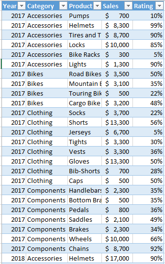
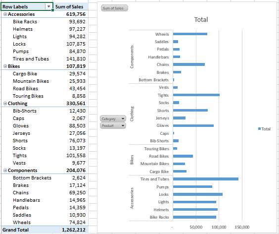
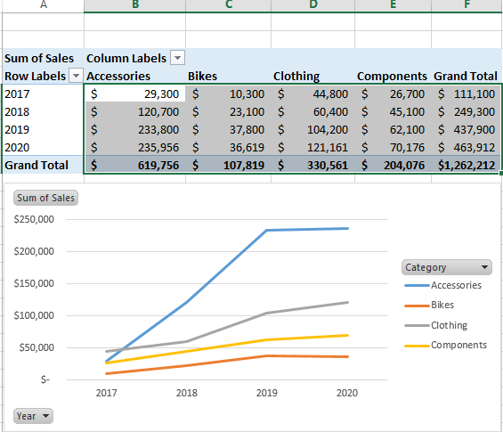
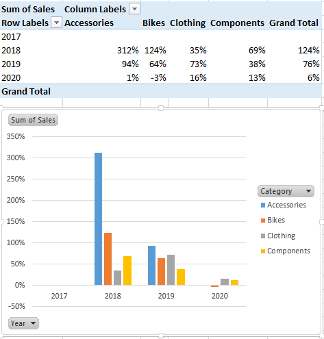
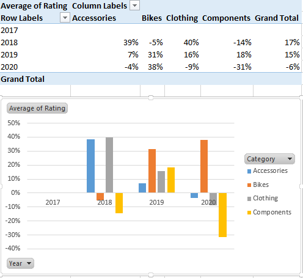
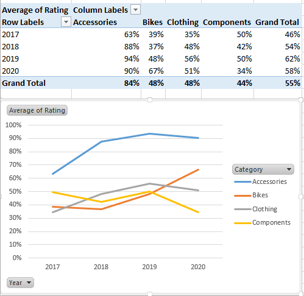
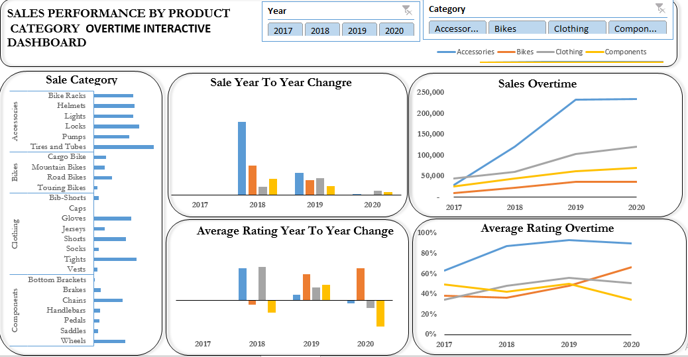

# Sale-Performance-By-Product-Category-Overtime
This is my first Excel project. Extraction, data cleaning and visualization were all done using Excel.

## Introduction;
- I'm working as a data analyst for a retail company, the manager assigned me the task of representing the sale performance of the product categories, revenue generated by each of the product categories of the company. over the specified years, the goal is to provide a clear and informative visual representation for the company's executives during their yearly meeting review. 

## Problem Statement;
The executives are perticularly interested in understanding which product categories have shown the most  significant growth and which product might need further attention. So, after critical thinking, i have to provide answers to the following questions:
  1. What is the Product Category that generated Highest Sales Over the years?
  2. Product Category with the Highest Sales Turn over?
  3. Product Category Sale comparison over the years?
  4. Average rating comparison over time(year on year basis)?
  5. Average rating over time?

## Data Sourcing:
- The dataset was extracted from Quantum Analytics NG.

## Data Validation 
- Data validation applied accordingly.

## User Interface And Navigation
- Charts are locked to prevent unintentional distortion while pivot slicers and legend icons unlocked.

## Dataset Overview
- The dataset contains the sale of four (4) categories of products and their ratings over the years.
  

## Data Transformation;
- The data is a cleaned dataset, So the process i took in order to provide answers to the above questions are:
1. I Structured the dataset into table
 
 

2. I loaded the dataset to pivot table to create report via pivot charts
3. I designed my dashboard with the reports and most important metrics

## Data Analysis/Visualization;
- Analysis was done using simple pivot visuals.

1. It is interesting to discover the Product Category with the highest sales
 
 

- Accessory products has the highest sale among the product categories.

2. It is also interesting to discover the Product Category with the highest Revenue over the years. 
 
  

- Accessories generated the highest Revenue over the years.

3. With further visual analysis,It is also of interest to compare the Product Category with the highest sales on yearly basis
 
  

- 2018 has the highest sales since the dataset does not include 2016. 2018 sales is compared with the sales of  year 2019.

4. 

- 2018 recieved the highest average ratings in which clothing product category has the highest average rating among the product categories.

5. 

- Accessory Products recieved the highest average ratings over the years.

## Conclusion/Recommendation;
- Accessory products category have shown the most  significant growth while component products category needs utmost attention.

## Dashboard Overview

### My goal is to provide value to the stakeholders and not just to build reports and dashboard. 

Thank you 😂

